<!-- HERO -->

<h1 align="center">Akrm Qubati</h1>

<!-- Typing intro -->
  <a href="https://readme-typing-svg.demolab.com?font=Inter&weight=600&pause=1200&color=7C3AED&width=600&lines=Full+Stack+Web+%26+Mobile+Developer;UI%2FUX+Design+%26+Prototyping;API+%26+AI+Integrations;Performance+%26+Accessibility+Focused">
    
 
    
  </a>

  
  
  
  

---

## 👨‍💻 About Me
- 🌍 YEMEN,SANA'A 
- 💻 **Full Stack Web**: HTML, CSS, JavaScript, React, Next.js, Framer Motion, Tailwind, Bootstrap, Laravel, Node.js, Python  
- 📱 **Mobile Development**: Flutter, Firebase, Rive animations  
- 🎨 **UI/UX**: Figma, design systems, prototypes, responsive & accessible design  
- 🤖 **APIs & AI**: REST, GraphQL, AI integrations (OpenAI, Sanity, LangChain, etc.)  
- ⚙️ **Backend & Ops**: MySQL, Docker, Laravel  
- ✨ Motto: *Crafting code through a designer’s lens.*

---

## 🛠️ Tech Stack

  

  
  
  
  

---

## 🚀 Featured Projects
<table>
  <tr>
    <td width="50%" style="border: none; padding: 10px;">
      
      <h3>Project Alpha</h3>
      
E-commerce frontend with Next.js + Tailwind

      <h1>comming soon</h1>
      
      
    </td>
    <td width="50%" style="border: none; padding: 10px;">
      
      <h3>Project Beta</h3>
      
Cross-platform mobile app (Flutter + Firebase)

      <h1>comming soon</h1>
      
      
    </td>
  </tr>
</table>

---

## 📊 GitHub Stats

  
  

  

  

---

## 🐍 Contribution Snake
<picture>
  <source media="(prefers-color-scheme: dark)" srcset="https://raw.githubusercontent.com/akrmcodes/akrmcodes/output/snake-dark.svg">
  
</picture>

---

## 🤝 Let’s Connect
- 📧 **Email:** akrm.codes@gmail.com  
- 💼 **LinkedIn:** [Soon](https://www.linkedin.com/in/{{handle}})  
- 🐦 **Twitter/X:** [@Soon](https://x.com/{{handle}})  
- 🌐 **Portfolio:** [Soon](https://{{my-portfolio-or-placeholder}})

---

**Last update:** 2025-08-26 05:33 UTC  
> Auto-refresh: stats embeds & shields cache likely updated.
<!-- DYNAMIC:END -->

<!-- DYNAMIC:START -->
**Last update:** 2025-09-30 05:31 UTC  
> Auto-refresh: stats embeds & shields cache likely updated.
<!-- DYNAMIC:END -->
