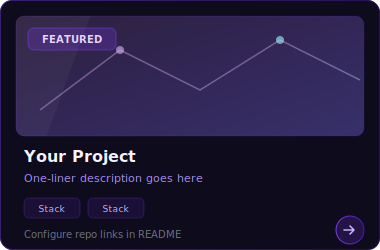

<!-- Aurora Studio — akrmcodes profile README -->


<h1 align="center">Akrm Qubati</h1>

<p align="center">
  
</p>

<p align="center">
  <a href="mailto:akrm.codes@gmail.com"></a>
  <!-- SOCIAL:LINKEDIN: https://www.linkedin.com/in/YOUR_HANDLE -->
  <a href="https://www.linkedin.com/in/YOUR_HANDLE"></a>
  <!-- SOCIAL:TWITTER: https://x.com/YOUR_HANDLE -->
  <a href="https://x.com/YOUR_HANDLE"></a>
  <!-- SOCIAL:PORTFOLIO: https://YOUR-PORTFOLIO-URL -->
  <a href="https://github.com/akrmcodes"></a>
</p>

<br>

<!-- ═══════════════ BENTO DASHBOARD ═══════════════ -->

<table>
  <tr>
    <td width="50%" valign="top" style="border:none;padding:6px;">
      
    </td>
    <td width="50%" valign="top" style="border:none;padding:6px;">
      
      <br><br>
      
    </td>
  </tr>
  <tr>
    <td colspan="2" valign="top" style="border:none;padding:6px;">
      
    </td>
  </tr>
  <tr>
    <td width="55%" valign="top" style="border:none;padding:6px;">
      
    </td>
    <td width="45%" valign="top" style="border:none;padding:6px;">
      
    </td>
  </tr>
</table>

<br>

<details>
<summary><strong>Studio Manifesto</strong></summary>

<br>

```yaml
name: Akrm Qubati
role: Designer-Engineer
location: Sana'a, Yemen
focus:
  - full-stack web (React, Next.js, Laravel, Node)
  - mobile (Flutter, Firebase, Rive)
  - ui-ux (Figma, design systems, prototypes)
  - apis-and-ai (REST, GraphQL, OpenAI, LangChain)
principles:
  - performance-first
  - accessibility (WCAG)
  - design-through-code
motto: Crafting code through a designer's lens.
```

</details>

<br>

## Featured Projects

<table>
  <tr>
    <td width="33%" valign="top" style="border:none;padding:8px;">
      
      <p align="center">
        <!-- PROJECT:1:NAME -->Your Project<!-- /PROJECT:1:NAME --><br>
        <sub><!-- PROJECT:1:DESC -->One-liner description<!-- /PROJECT:1:DESC --></sub><br>
        <a href="https://github.com/akrmcodes"></a>
        <a href="https://github.com/akrmcodes"></a>
      </p>
    </td>
    <td width="33%" valign="top" style="border:none;padding:8px;">
      
      <p align="center">
        <!-- PROJECT:2:NAME -->Your Project<!-- /PROJECT:2:NAME --><br>
        <sub><!-- PROJECT:2:DESC -->One-liner description<!-- /PROJECT:2:DESC --></sub><br>
        <a href="https://github.com/akrmcodes"></a>
        <a href="https://github.com/akrmcodes"></a>
      </p>
    </td>
    <td width="33%" valign="top" style="border:none;padding:8px;">
      
      <p align="center">
        <!-- PROJECT:3:NAME -->Your Project<!-- /PROJECT:3:NAME --><br>
        <sub><!-- PROJECT:3:DESC -->One-liner description<!-- /PROJECT:3:DESC --></sub><br>
        <a href="https://github.com/akrmcodes"></a>
        <a href="https://github.com/akrmcodes"></a>
      </p>
    </td>
  </tr>
</table>

<br>

## Contribution Graph

<picture>
  <source media="(prefers-color-scheme: dark)" srcset="https://raw.githubusercontent.com/akrmcodes/akrmcodes/output/snake-dark.svg">
  
</picture>

<br>

## Connect

<p align="center">
  <a href="mailto:akrm.codes@gmail.com">akrm.codes@gmail.com</a>
  &nbsp;·&nbsp;
  <a href="https://www.linkedin.com/in/YOUR_HANDLE">LinkedIn</a>
  &nbsp;·&nbsp;
  <a href="https://x.com/YOUR_HANDLE">X / Twitter</a>
  &nbsp;·&nbsp;
  <a href="https://github.com/akrmcodes">Portfolio</a>
</p>

<br>

<!-- DYNAMIC:START -->
**Last update:** 2026-06-23 00:00 UTC  
> Auto-refresh: stats embeds & shields cache likely updated.
<!-- DYNAMIC:END -->
