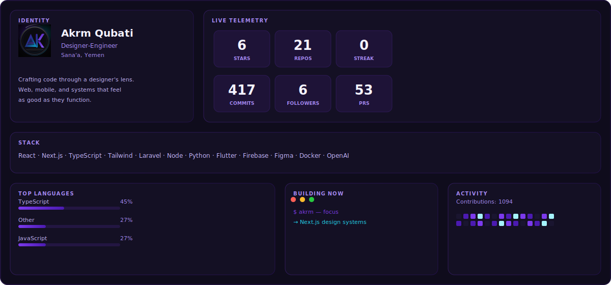
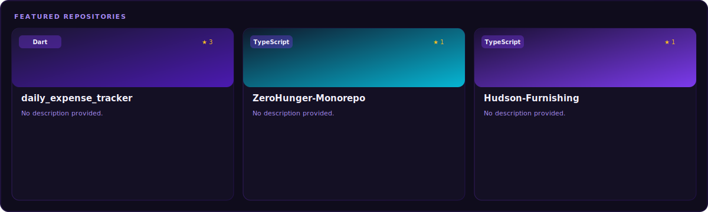
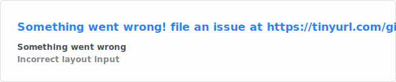

<!-- Designer OS — akrmcodes profile (native SVG — GitHub-safe) -->

<strong>Quick scan — for recruiters</strong>

 

- **Full-stack web + Flutter mobile** · Sana'a, Yemen
- **Stack:** React, Next.js, Laravel, Node, Python, Flutter, Firebase, Docker, MySQL
- **UI/UX:** Figma, design systems, prototypes, WCAG-focused builds
- **APIs & AI:** REST, GraphQL, OpenAI, LangChain, Sanity
- **Contact:** [akrm.codes@gmail.com](mailto:akrm.codes@gmail.com)

 

 

  
  
  

 

## Contribution Graph

<picture>
  <source media="(prefers-color-scheme: dark)" srcset="https://raw.githubusercontent.com/akrmcodes/akrmcodes/output/snake-dark.svg">
  
</picture>

 

## Connect

  <a href="mailto:akrm.codes@gmail.com">akrm.codes@gmail.com</a>
  &nbsp;&middot;&nbsp;
  <a href="https://www.linkedin.com/in/YOUR_HANDLE">LinkedIn</a>
  &nbsp;&middot;&nbsp;
  <a href="https://x.com/YOUR_HANDLE">X / Twitter</a>
  &nbsp;&middot;&nbsp;
  <a href="https://github.com/akrmcodes">Portfolio</a>

 

<strong>Extended GitHub stats</strong>

 

  
  

  

 

<!-- DYNAMIC:START -->
**Last update:** 2026-07-13 08:27 UTC  
> Auto-refresh: stats embeds & shields cache likely updated.
<!-- DYNAMIC:END -->
